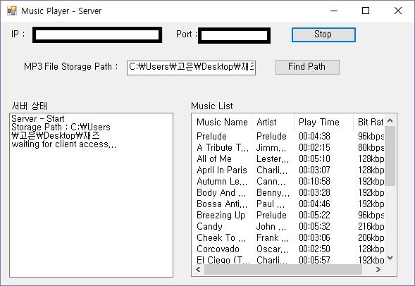
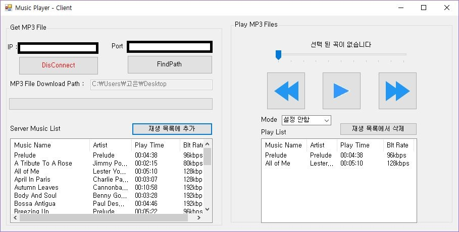

# MusicPlayer (based C#)

### Function - server version

1. Select a folder that contains mp3 files and list the .mp3 files in the folder
2. Press the Start button to switch to Stop and wait for the client to connect
3. When client's request is received, all mp3 file information is sent to client music list
4. Transfer the mp3 file selected by the client via socket communication

### Function - client version

1. Enter the IP and port number for the server and click the Connect button
List the mp3 list that exists in the server
3. Select the storage path and add it to the desired mp3 file playlist and save the file via socket communication
4. Play, pause, fast forward and fast reverse mp3 files in playlist
5. Random play mode, single play mode available

#### Requirement
- C#, Visual Studio 2018
